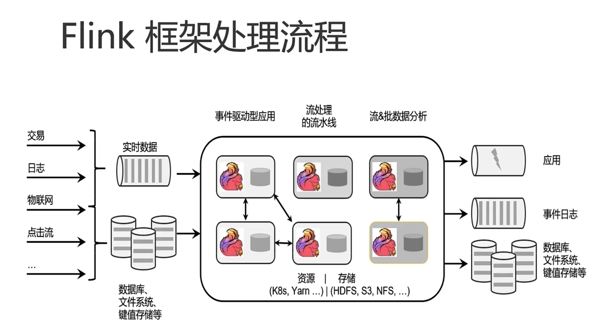
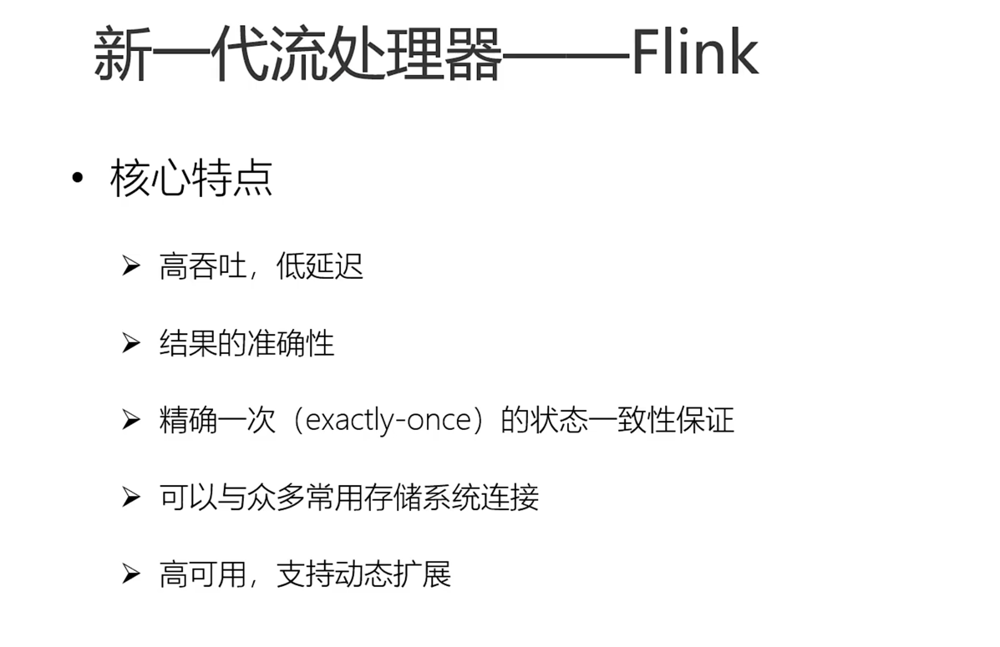
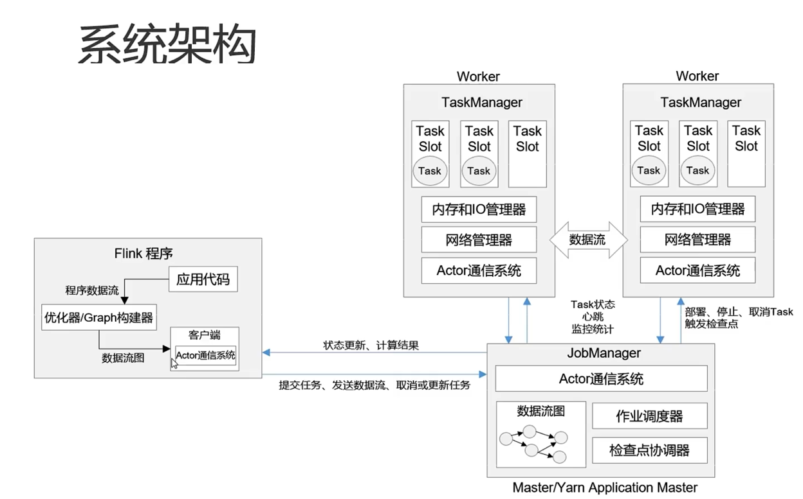

## Flink 框架处理流程
Apache Flink is a framework and distributed processing engine for stateful computations over unbounded and bounded data streams

Flink 是一个流式的分布式框架，处理有边界或没边界的流数据。

## Flink的应用场景

## 新一代流式处理器 -- Flink

 

## Flink VS Spark

### 数据处理架构

> spark ：微批计算
> 
> flink ：有界无界流计算

### 数据处理模型

> spark 采用RDD，Spark Streaming 的DStream 实际上也就是一组组小批数据的RDD
> 
> Flink 基本数据模型就是流处理，以事件序列
> 
### 运行时架构

>
> spark 批处理，将DAG 化分成不同的stage，一个stage处理完后，另一个stage 在处理
> 
> flink 是标准的流式处理，一个事件在一个节点上处理完后，回发送到另一个节点处理。
> 
### Flink 提交流程图

