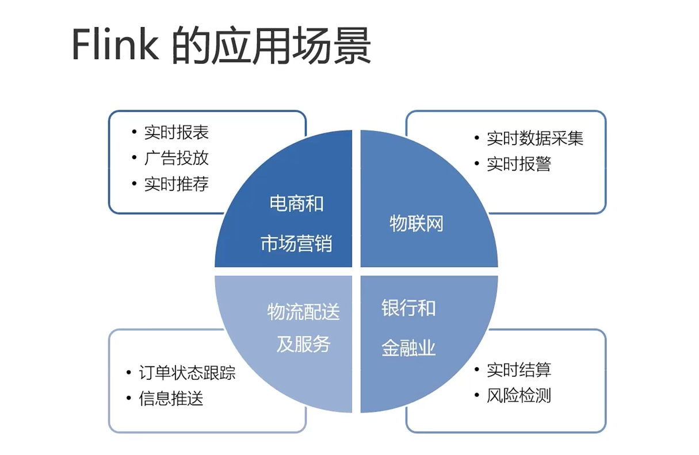
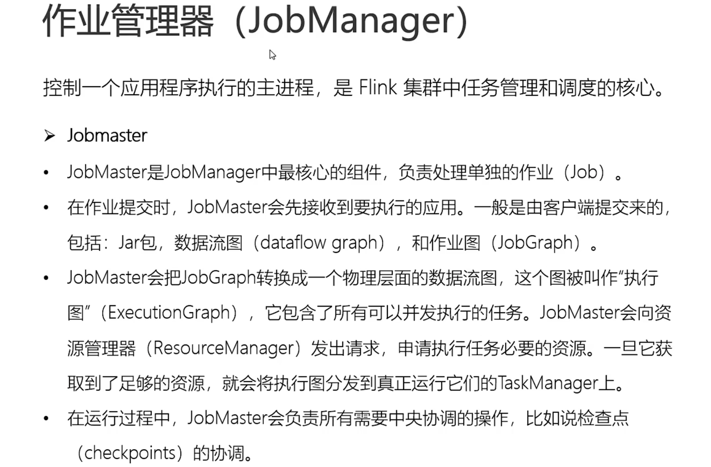
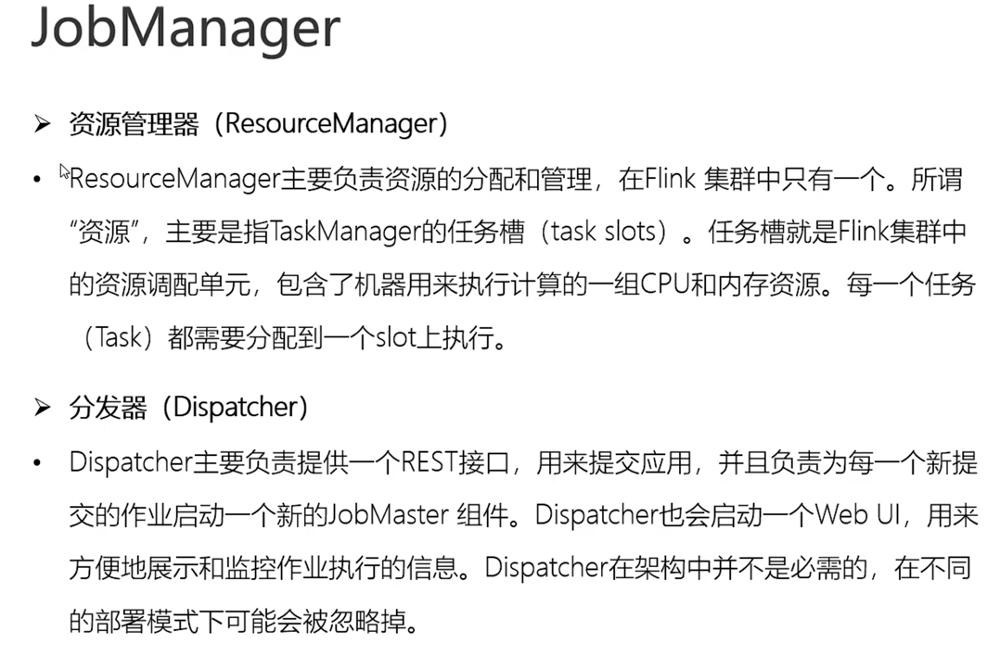
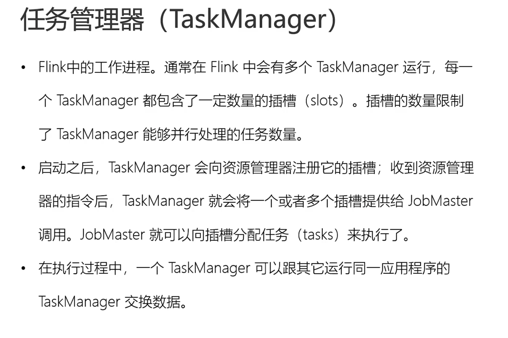
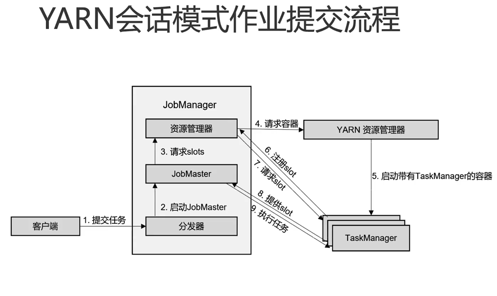
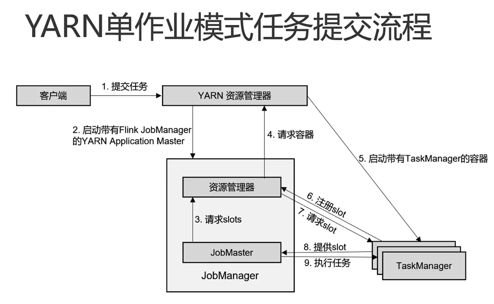

## Flink 框架处理流程
Apache Flink is a framework and distributed processing engine for stateful computations over unbounded and bounded data streams

Flink 是一个流式的分布式框架，处理有边界或没边界的流数据。

## Flink的应用场景

## 新一代流式处理器 -- Flink

 

## Flink VS Spark

### 数据处理架构

> spark ：微批计算
> 
> flink ：有界无界流计算

### 数据处理模型

> spark 采用RDD，Spark Streaming 的DStream 实际上也就是一组组小批数据的RDD
> 
> Flink 基本数据模型就是流处理，以事件序列
> 
### 运行时架构

>
> spark 批处理，将DAG 化分成不同的stage，一个stage处理完后，另一个stage 在处理
> 
> flink 是标准的流式处理，一个事件在一个节点上处理完后，回发送到另一个节点处理。
> 
### Flink 提交流程图

### 作业管理器 JobManager

## TaskManager

## Flink 任务提交 session 模式

## Flink任务提交 per-job 模式

## Flink Window

---

> 滚动窗口：窗口大小
> 
> 滑动窗口：窗口大小 + 滑动步长
> 
> 会话窗口：会话窗口只能基于时间来定义
> 
> 全局窗口： 会把相同key的数据分配到一个窗口，还需要自定一个触发器

